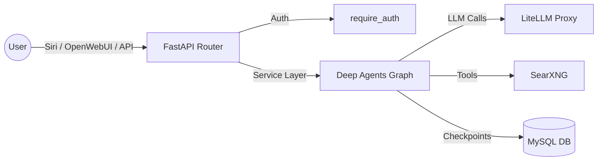

# Deep Research Module

A LangChain Deep Agents proof-of-concept integrated into the `ai-harness` project.
It uses `deepagents` with a `search_web` tool backed by SearXNG, and persists
agent state in MySQL via `langgraph-checkpoint-mysql`.

---

## 1. Architecture & Data Flow



- **Agent Framework**: `deepagents` (`create_deep_agent`)
- **LLM**: `ChatOpenAI` instantiated explicitly, routing through the existing LiteLLM proxy (`openai_api_base`)
- **Checkpointer**: `AsyncMySaver` from `langgraph.checkpoint.mysql.asyncmy`
- **State Storage**: Reuses the existing `ai_harness` MySQL database
- **Web Search**: Sync `httpx` call to SearXNG wrapped in a LangChain `@tool`

---

## 2. File Structure

All files for this module live in `ai-harness/deep_research/`:

- `__init__.py`: Module docstring
- `schemas.py`: Pydantic models (`DeepResearchRequest`, `DeepResearchResponse`)
- `service.py`: Core logic (`ensure_checkpointer_tables`, `get_deep_agent`, `run_deep_research`, message extraction helpers)
- `router.py`: FastAPI router exposing `/run` and `/run/stream`

---

## 3. Integration Points

When expanding this module, you must update the following integration points if endpoints or schemas change:

### A. FastAPI App Registration (`ai-harness/app.py`)
- **Import**: `from deep_research.service import ensure_checkpointer_tables`
- **Startup Event**: Uses `@app.on_event("startup")` to call `await ensure_checkpointer_tables()`. This creates the checkpoint tables on container boot.
- **Router Mount**: `app.include_router(deep_research_router, prefix="/workflows/deep-research", tags=["deep-research"])`

### B. Siri Integration (`ai-harness/siri/service.py`)
- **Intent Detection**: Checks for `"deep research"` in the voice text inside `_detect_intent()`. Returns `"deep_research"` intent.
- **Handler**: `_handle_deep_research(req)` POSTs to `{INTERNAL_BASE_URL}/workflows/deep-research/run` using `httpx.AsyncClient`.
- **Response Mapping**: Extracts `answer` and `sources` from the JSON response and maps them to `SiriChatResponse` (`speak`, `display`, `links`).

### C. OpenWebUI Integration (`ai-harness/openwebui_tools/harness_tools.py`)
- **Tool Function**: `deep_research(self, query)` POSTs to `/workflows/deep-research/run`.
- **Response Formatting**: Parses `answer`, `steps`, and `sources` into a markdown string for the OpenWebUI chat interface.

---

## 4. Critical Implementation Details & Gotchas

**DO NOT overlook these patterns when modifying `service.py`:**

### A. AsyncMySaver Context Manager Quirk
`AsyncMySaver.from_conn_string()` returns an `_AsyncGeneratorContextManager`, not the actual saver instance.
- **Solution**: We manually enter it using `await _checkpointer_ctx.__aenter__()` and store the context globally to keep the DB connection pool alive.
- **Setup Method**: The checkpointer uses `.setup()` (`async def setup(self)`), **NOT** `.asetup()`. Calling `.asetup()` will raise an `AttributeError`.

### B. Explicit LiteLLM Model Initialization
`deepagents` `create_deep_agent(model=...)` works best when passed a pre-initialized `BaseChatModel` rather than a raw string.
- **Solution**: We instantiate `ChatOpenAI` explicitly with `openai_api_base=f"{LITELLM_BASE_URL}/v1"` and `openai_api_key=LITELLM_API_KEY`. This guarantees it routes through the harness proxy regardless of environment state.

### C. LangChain BaseMessage Handling
LangGraph `ainvoke` returns actual LangChain `BaseMessage` objects (`AIMessage`, `ToolMessage`, `HumanMessage`), **NOT** plain dictionaries.
- **Solution**: Never use `.get()` on messages. Always use the `_safe_get(obj, "key")` helper defined in `service.py`, which checks `isinstance(obj, dict)` vs `getattr(obj, "key")`.
- **Role Types**: LangChain `AIMessage` uses `.type == "ai"` and `ToolMessage` uses `.type == "tool"`. The helpers account for both `"ai"`/`"tool"` and standard `"assistant"`/`"user"` roles.

---

## 5. API Endpoints & Testing

All endpoints are mounted under `/workflows/deep-research`.

### POST `/workflows/deep-research/run`
Runs the deep research agent synchronously and returns the final answer, steps, and sources.
*Requires `X-API-Key` header.*

### POST `/workflows/deep-research/run/stream`
Streams the agent's execution steps and updates via Server-Sent Events (SSE).

### Testing
Run the pure bash integration test script from the `ai-harness` directory:
```bash
cd ai-harness
bash tests/test_deep_research.sh
```
*Note: The test script automatically sources `../../.env` to get `INTERNAL_BASE_URL` and `HARNESS_API_KEY`.*

---

## 6. Phase 1 Expansion Roadmap

Once the skeleton is validated, the following features are planned:

1. **Multi-step Pipeline**: Chain multiple search -> read -> synthesize steps.
2. **Crawl4AI Integration**: Add a `crawl_web` tool to fetch full page content from search result URLs.
3. **Query Decomposition**: Let the LLM break complex questions into sub-queries before searching.
4. **Subagents**: Use `deepagents` subagent middleware to delegate specific tasks (e.g., a dedicated "summarizer" subagent).
5. **Structured Output**: Enforce a JSON schema for the final answer to easily parse sections (Executive Summary, Key Findings, Sources).
