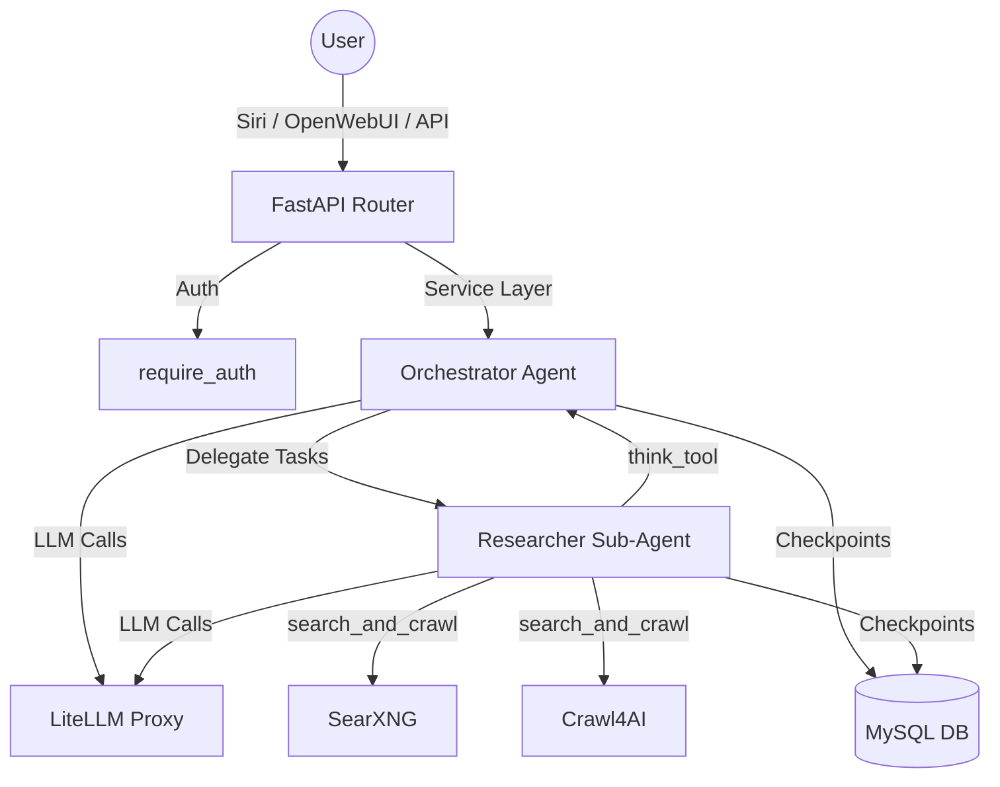

# Deep Research Module

A multi-agent deep research system using `deepagents` with sub-agent delegation.
An orchestrator agent plans research via TODOs, delegates to researcher sub-agents
that search via SearXNG + Crawl4AI with strategic reflection, then synthesizes
a final report. Agent state is persisted in MySQL via `langgraph-checkpoint-mysql`.

Adapted from [langchain-ai/deepagents/examples/deep_research](https://github.com/langchain-ai/deepagents/tree/main/examples/deep_research).

---

## 1. Architecture & Data Flow



- **Agent Framework**: `deepagents` (`create_deep_agent` with `subagents=[...]`)
- **Orchestrator**: Plans via TODOs, delegates research tasks, synthesizes findings, writes final report
- **Researcher Sub-Agent**: Conducts focused searches with `search_and_crawl` + `think_tool` reflection
- **LLM**: `ChatOpenAI` routing through LiteLLM proxy
- **Checkpointer**: `AsyncMySaver` from `langgraph.checkpoint.mysql.asyncmy`
- **Web Search**: SearXNG for URL discovery + Crawl4AI for full-page markdown extraction
- **Reflection**: `think_tool` for strategic pauses between searches

---

## 2. File Structure

All files for this module live in `ai-harness/deep_research/`:

- `__init__.py`: Module docstring
- `schemas.py`: Pydantic models (`DeepResearchRequest`, `DeepResearchResponse`)
- `service.py`: Core logic (checkpointer, agent factory with orchestrator + sub-agent, message extraction)
- `prompts.py`: Three instruction templates (workflow, researcher, delegation strategy)
- `tools.py`: Research tools (`search_and_crawl`, `think_tool`)
- `router.py`: FastAPI router exposing `/run` and `/run/stream`

---

## 3. Citation System

The module extracts the orchestrator's final report and its source references so
users can click through to verify claims.

### Answer Extraction (`_extract_answer`)
Scans messages for the `write_file` tool call targeting `/final_report.md` and
extracts the report content directly from `args.content`. This is concurrency-safe:
each run has its own isolated message list (scoped by `thread_id`), so multiple
concurrent runs never collide or overwrite each other's reports. Falls back to
the last AI message if no final report was written.

### Source Extraction (`_extract_sources`)
Parses `## Title\n**URL:** url` blocks from every `search_and_crawl` tool result,
deduplicates by URL, and returns `[{title, url}]`.

### OpenWebUI Clickable Citations
`openwebui_tools/harness_tools.py` post-processes the answer: every `[N]` is
converted to `[N](url "Title")` using the matching source. The sources section
at the bottom also renders as `[{i}] [title](url)`. This gives users clickable
links inline and in the reference list to verify agent findings.

---

## 4. Prompt Architecture

### Orchestrator (`RESEARCH_WORKFLOW_INSTRUCTIONS` + `SUBAGENT_DELEGATION_INSTRUCTIONS`)
The orchestrator follows a 6-step workflow:
1. **Plan**: Create TODO list via `write_todos`
2. **Save Request**: Write user question to `/research_request.md`
3. **Research**: Delegate to sub-agents (default: 1 sub-agent per query)
4. **Synthesize**: Review all sub-agent findings, consolidate citations
5. **Write Report**: Write final report to `/final_report.md` with proper structure
6. **Verify**: Confirm all aspects of the question are addressed

### Researcher (`RESEARCHER_INSTRUCTIONS`)
The sub-agent follows a human-like research pattern:
1. **Read question carefully**
2. **Start with broad searches**
3. **After each search → think_tool reflection**
4. **Execute narrower searches as gaps are identified**
5. **Stop when confident** (max 5 search calls)

### Delegation Strategy (`SUBAGENT_DELEGATION_INSTRUCTIONS`)
- **Default**: 1 sub-agent for most queries
- **Parallel**: Only for explicit comparisons or clearly separated aspects
- **Limits**: Max 3 concurrent sub-agents, max 3 delegation rounds

---

## 5. Integration Points

### A. FastAPI App Registration (`ai-harness/app.py`)
- **Import**: `from deep_research.service import ensure_checkpointer_tables`
- **Startup Event**: `await ensure_checkpointer_tables()` creates checkpoint tables on boot
- **Router Mount**: `app.include_router(deep_research_router, prefix="/workflows/deep-research", tags=["deep-research"])`

### B. Siri Integration (`ai-harness/siri/service.py`)
- **Intent Detection**: `"deep research"` → `"deep_research"` intent
- **Handler**: `_handle_deep_research(req)` POSTs to `/workflows/deep-research/run`
- **Response Mapping**: Extracts `answer` and `sources` → `SiriChatResponse`

### C. OpenWebUI Integration (`ai-harness/openwebui_tools/harness_tools.py`)
- **Tool Function**: `deep_research(self, query)` POSTs to `/workflows/deep-research/run`
- **Response Formatting**: Parses `answer`, `steps`, `sources` → markdown

---

## 6. Critical Implementation Details & Gotchas

### A. AsyncMySaver Context Manager Quirk
`AsyncMySaver.from_conn_string()` returns `_AsyncGeneratorContextManager`, not the saver.
- Manually enter with `await _checkpointer_ctx.__aenter__()` and store globally
- Use `.setup()` (NOT `.asetup()`)

### B. Sub-Agent Tool Isolation
Sub-agents have their own tool scope — they get `search_and_crawl` + `think_tool`
but cannot directly call the orchestrator's tools. The orchestrator delegates via
`task()` calls to the sub-agent and receives findings back.

### C. `search_and_crawl` Tool
- **SearXNG**: URL discovery via `httpx.get` (sync, timeout=15s)
- **Crawl4AI**: Full-page markdown via `httpx.post` (sync, timeout=45s)
- Returns formatted markdown with `## Title`, `**URL:**`, `### Snippet`, `### Full Content`
- Graceful degradation if Crawl4AI is down

### D. LangChain BaseMessage Handling
Always use `_safe_get(obj, "key")` helper — never `.get()` on messages.

---

## 7. API Endpoints & Testing

All endpoints mounted under `/workflows/deep-research`.

### POST `/workflows/deep-research/run`
Runs the deep research agent synchronously. Returns final answer, steps, and sources.
*Requires `X-API-Key` header.*

### POST `/workflows/deep-research/run/stream`
Streams agent execution via Server-Sent Events (SSE).

### Testing
```bash
cd ai-harness
bash tests/test_deep_research.sh
```

---

## 8. Configuration

| Env Var | Default | Purpose |
|---|---|---|
| `HARNESS_MODEL` | `gemma-moe` | LLM model (via LiteLLM) |
| `LITELLM_BASE_URL` | `http://litellm:4000` | LiteLLM proxy URL |
| `SEARXNG_BASE_URL` | `http://searxng:8080` | SearXNG instance |
| `CRAWL4AI_BASE_URL` | `http://crawl4ai:11235` | Crawl4AI instance |
| `MYSQL_DB_HOST` | `host.docker.internal` | MySQL host |
| `AI_DB_NAME` | `ai_harness` | MySQL database name |

Delegation limits in `service.py`:
- `MAX_CONCURRENT_RESEARCH_UNITS = 3` (parallel sub-agents)
- `MAX_RESEARCHER_ITERATIONS = 3` (delegation rounds)
