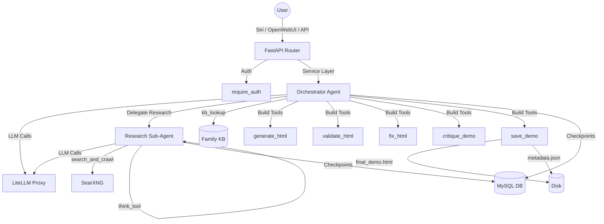

# Demo Workflow Module

An automated, LLM-driven pipeline that researches, designs, builds, validates,
and saves high-quality single-file HTML demos. Built on the `deepagents`
framework with a single orchestrator agent that follows the 8-phase demo
creation pipeline. Agent state is persisted in MySQL via
`langgraph-checkpoint-mysql`.

---

## 1. Architecture & Data Flow

- **Agent Framework**: `deepagents` (`create_deep_agent` with `subagents=[...]`)
- **Orchestrator**: Follows the 8-phase workflow, manages build tools, delegates research
- **Research Sub-Agent**: Conducts web research with `search_and_crawl` + `think_tool`
- **LLM**: `ChatOpenAI` routing through LiteLLM proxy
- **Checkpointer**: `AsyncMySaver` from `langgraph.checkpoint.mysql.asyncmy`
- **Build Tools**: `generate_html`, `validate_html`, `fix_html`, `critique_demo`, `save_demo`
- **KB Lookup**: `kb_lookup` tool calls `family_kb.search_kb()` directly

---

## 2. 8-Phase Workflow

The orchestrator follows these phases guided by its system prompt:

1. **Parse Request** — Extract a structured demo brief (title, audience, features, screens, style)
2. **KB Lookup** — Query the Family Knowledge Base for prior relevant material
3. **Web Research** — Delegate to the research sub-agent for competitor patterns and UX conventions
4. **Requirements & Design** — Synthesize all research into a design spec (colors, typography, layout)
5. **Build Plan** — Produce a numbered step-by-step implementation plan with acceptance criteria
6. **Build Loop** — Iteratively: `generate_html` → `validate_html` → `fix_html` (max 2 retries/step)
7. **Polish** — `critique_demo` for full-pass quality review, then `fix_html` for top issues
8. **Save** — `save_demo` embeds notes as HTML comments, writes `final_demo.html` + `metadata.json`

---

## 3. File Structure

All files for this module live in `ai-harness/demo_workflow/`:

- `__init__.py`: Module docstring + re-export `ensure_checkpointer_tables`
- `schemas.py`: Pydantic models (`DemoCreateRequest`, `DemoCreateResponse`, `DemoMetadata`)
- `service.py`: Agent factory, `run_demo()`, MySQL checkpointer, `kb_lookup` tool, extraction helpers
- `prompts.py`: `DEMO_WORKFLOW_INSTRUCTIONS` (orchestrator), `RESEARCHER_INSTRUCTIONS` (sub-agent), build prompts
- `tools.py`: Build tools (`generate_html`, `validate_html`, `fix_html`, `critique_demo`, `save_demo`)
- `router.py`: FastAPI router exposing `/run`, `/run/stream`, `/jobs`, `/{slug}`, `/{slug}/html`

---

## 4. Output Extraction

The module extracts the agent's output artifacts from the LangGraph message history:

### HTML Extraction (`_extract_html_path`, `_extract_final_html`)
Scans messages for the `write_file` tool call targeting `final_demo.html` and
extracts the content from `args.content`. Falls back to `current_build.html`,
then to any HTML-like content in tool results.

### Metadata Extraction (`_extract_metadata`)
Parses the `save_demo` tool output for `local_url`/`public_url` and other
metadata. Falls back to basic metadata from `demo_brief.md`.

### Title Extraction (`_extract_title`)
Extracts the demo title from `demo_brief.md` content, falling back to the
request title.

---

## 5. Prompt Architecture

### Orchestrator (`DEMO_WORKFLOW_INSTRUCTIONS`)
The orchestrator follows an 8-phase workflow with explicit file conventions:
- `demo_brief.md` — Phase 1 structured brief
- `design_spec.md` — Phase 4 requirements and design
- `build_plan.md` — Phase 5 numbered build steps
- `current_build.html` — Phase 6 iterative build output
- `final_demo.html` — Phase 8 final output

### Researcher (`RESEARCHER_INSTRUCTIONS`)
The sub-agent follows a focused research pattern:
1. Start with broad searches
2. After each search → `think_tool` reflection
3. Execute narrower searches as gaps are identified
4. Stop when confident (max iterations configurable)

### Build Prompts
- `BUILD_GENERATE_SYSTEM` — HTML generation prompt
- `BUILD_VALIDATE_SYSTEM` — Validation prompt with pass/fail criteria
- `BUILD_FIX_SYSTEM` — Fix prompt for corrective changes

---

## 6. Integration Points

### A. FastAPI App Registration (`ai-harness/app.py`)
- **Import**: `from deep_research.service import ensure_checkpointer_tables`
  (shared with demo_workflow via re-export)
- **Startup Event**: `await ensure_checkpointer_tables()` creates checkpoint tables on boot
- **Router Mount**: `app.include_router(demo_workflow_router, prefix="/demos", tags=["demo-workflow"])`

### B. Siri Integration (`ai-harness/siri/service.py`)
- **Intent Detection**: `"create demo"` / `"build demo"` → `"create_demo"` intent
- **Handler**: `_handle_create_demo_workflow(req)` uses `asyncio.create_task()` fire-and-forget
  to POST `/demos/run` in the background. Siri responds immediately.
- **Listing**: `list_demos` / `find_demo` handlers read `metadata.json` from disk
- **Response Mapping**: Returns immediately with "Demo build started" message

### C. OpenWebUI Integration (`ai-harness/openwebui_tools/harness_tools.py`)
- **Tool Function**: `create_demo(self, title, prompt, model)` POSTs to `/demos/run`
  synchronously (timeout=600s). Returns demo URL on completion.
- **Listing**: `list_demos(tags, limit)` and `find_demo(query, limit)` read from `/demos/` and `/demos/search`

---

## 7. Critical Implementation Details & Gotchas

### A. Shared MySQL Checkpointer
Demo workflow shares the same MySQL checkpoint tables as deep_research.
Both import from `deep_research.service`. The checkpointer is process-global
and thread-safe — concurrent runs are isolated by `thread_id`.

### B. Build Loop as Direct Tools (Not Sub-Agent)
The build loop (generate → validate → fix) runs as direct tools on the
orchestrator, NOT as a sub-agent. This avoids delegation overhead for the
tight iterative cycle. The orchestrator stays in control.

### C. File-Based Intermediate State
Intermediate artifacts (design spec, build plan, HTML) use `write_file`
for persistence between phases. The orchestrator reads/writes files as it
progresses. This mirrors deep_research's `/final_report.md` pattern.

### D. KB Lookup Timeout Handling
The `kb_lookup` tool wraps `family_kb.search_kb()` with a try/except to
handle cold-start embedding model downloads gracefully. Returns a fallback
message on failure, allowing the workflow to continue with web research.

### E. Sub-Agent Tool Isolation
The research sub-agent has its own tool scope (`search_and_crawl` + `think_tool`)
and cannot call the orchestrator's build tools. The orchestrator delegates via
`task()` calls and receives findings back as text.

### F. LangChain BaseMessage Handling
Always use `_safe_get(obj, "key")` helper — never `.get()` directly on
message objects (they may be Pydantic models or dicts).

---

## 8. API Endpoints & Testing

All endpoints mounted under `/demos`.

### POST `/demos/run`
Runs the demo creation agent synchronously. Returns final title, slug,
HTML path, and metadata.
*Requires `X-API-Key` header.*

### POST `/demos/run/stream`
Streams agent execution via Server-Sent Events (SSE). Yields JSON events
for each tool call, AI message, and completion.

### GET `/demos`
List all completed demos from the metadata index. Optional `tag` filter.

### GET `/demos/search?q=...`
Search demos by natural language query (matches title, description, tags).

### GET `/demos/{slug}`
Get a single demo's metadata from `metadata.json`.

### GET `/demos/{slug}/html`
Serve the final HTML file as `text/html`.

### GET `/demos/jobs`
List recent demo jobs from completed demos on disk.

### GET `/demos/jobs/{thread_id}`
Get job status for a given thread ID.

### POST `/demos/jobs/{thread_id}/cancel`
Best-effort cancellation for running jobs.

---

## 9. Configuration

| Env Var | Default | Purpose |
|---|---|---|
| `HARNESS_MODEL` | `gemma-moe` | LLM model (via LiteLLM) |
| `LITELLM_BASE_URL` | `http://litellm:4000` | LiteLLM proxy URL |
| `LITELLM_API_KEY` | — | LiteLLM API key |
| `MEDIA_OUTPUT_DIR` | `/data/media` | Base for generated media |
| `SEARXNG_BASE_URL` | `http://searxng:8080` | SearXNG instance |
| `CRAWL4AI_BASE_URL` | `http://crawl4ai:11235` | Crawl4AI instance |
| `MYSQL_DB_HOST` | `host.docker.internal` | MySQL host |
| `AI_DB_NAME` | `ai_harness` | MySQL database name |

Configuration in `service.py`:
- `MAX_RESEARCHER_ITERATIONS = 3` (sub-agent iteration limit)

---

## 10. Migrated From Celery (Historical)

This module was previously built on a Celery + workflow engine architecture
with 8 hard-coded stages dispatched as Celery tasks. The migration to
`deepagents` eliminated:

- **Celery tasks** (`tasks.py` deleted) — no more `run_stage` task
- **JSON file state** (`state/` directory) — agent manages state via message history
- **Workflow engine dependency** — no more DAG step definitions
- **Race conditions** — single-process agent eliminates cross-process state issues
- **Timeout hacks** — the 60s threading timeout for KB lookup is gone

The Celery worker is still used by other modules (`tasks/`, `scheduler/`,
`market_research/`). Only the demo workflow has migrated to deep agents.
